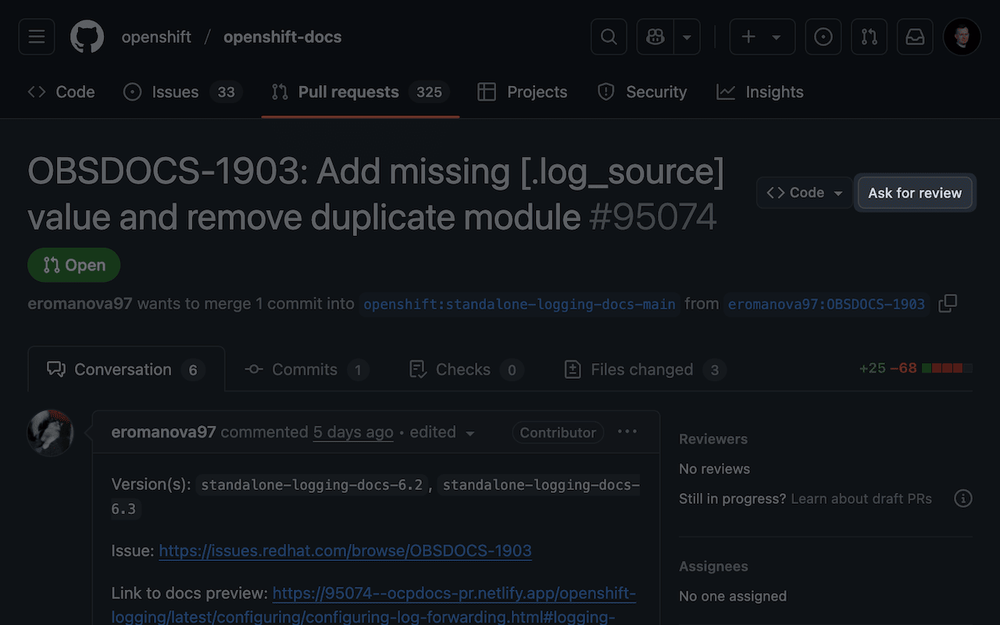
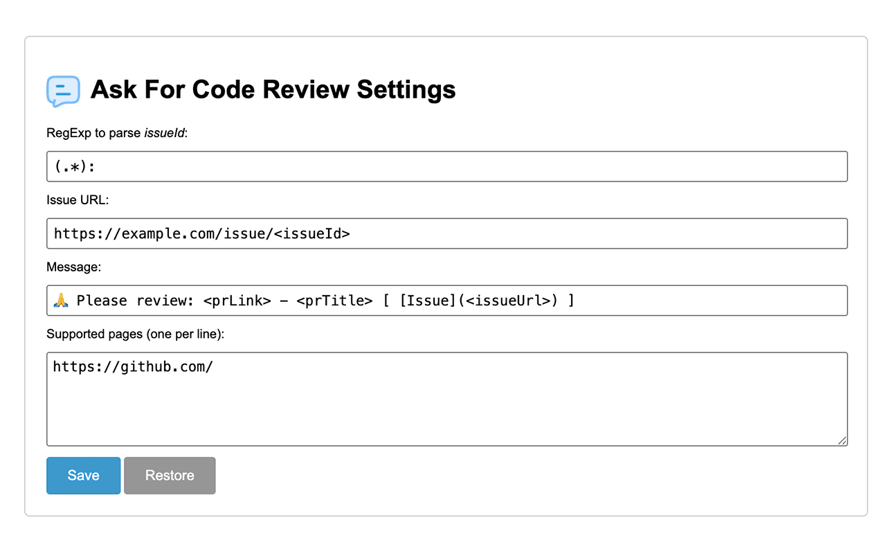

# ask-for-code-review

🧩 Chrome extension that adds a button to GitHub Pull Requests to generate a code review request message with an issue link.

## How does it work? 🚀

- Create a GitHub Pull Request with a title in the format: `JIRA_ID: My PR title`
  - Example: `JIRA-123: Fix the bug in the code`

> [!IMPORTANT]
> The extension extracts the issue ID from the PR title. You can use any format, but the issue ID must be present in the title.

- Open a GitHub Pull Request page.
- Note: On the same line as the PR title, you will see a button labeled <kbd>Ask for review</kbd>.
- Clicking it will generate a message containing the PR link, PR title, and issue link.

> [!TIP]
> The issue URL and message format can be configured in the extension settings.

- The message will be copied to the clipboard 📋.
- You can paste the message in a comment or chat to request a code review 🎊.

Example _(with default configuration)_:

[](https://github.com/openshift/openshift-docs/pull/95074)

Clicking the button above will copy the following message to the clipboard:

```
🙏 Please review: https://github.com/openshift/openshift-docs/pull/95074 - OBSDOCS-1903: Add missing [.log_source] value and remove duplicate module [ [Issue](https://example.com/issue/OBSDOCS-1903) ]
```

> [!NOTE]
> The extension works only on open GitHub Pull Requests, not on Issues.

## Download 📥

You can download the extension from the [Chrome Web Store](https://chromewebstore.google.com/) or clone the repository to use it locally.

## Installation (manual) 📦

- Open `chrome://extensions/`.
- Enable developer mode.
- Click on "Load unpacked".
- Select the folder where the extension is located.

## Setup (required) ⚙️

- Open the extension `Options` (click on the extension icon).
  - Define a format (_RegExp_) to parse <em>issueId</em>: `"(.*):"`
  - Set an issue URL in the format: `https://example.com/issue/<issueId>`
    - `<issueId>` will be replaced with the issue ID extracted from the PR title.
  - Set a message in the format: `🙏 Please review: <prLink> - <prTitle> [ [Issue](<issueUrl>) ]`
    - `<prLink>` will be replaced with the PR link.
    - `<prTitle>` will be replaced with the PR title.
    - `<issueUrl>` will be replaced with the issue URL.
    - _(Optionally)_ `<issueId>` will be replaced with the issue ID extracted from the PR title.
  - Add GitHub URLs where the extension should be active: `https://github.com/`
    - You can add multiple URLs, one per line.
- Click on "Save."



## Privacy Policy

https://github.com/piecioshka/ask-for-code-review/blob/main/privacy-policy.md

## License

[The MIT License](https://piecioshka.mit-license.org/) @ 2025
